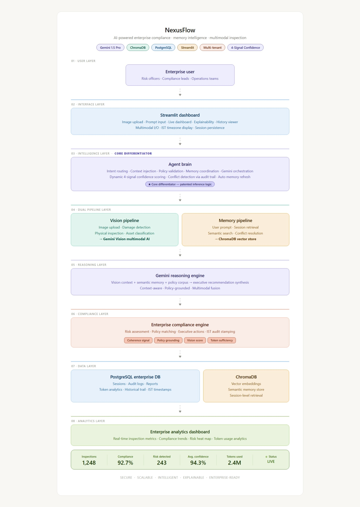
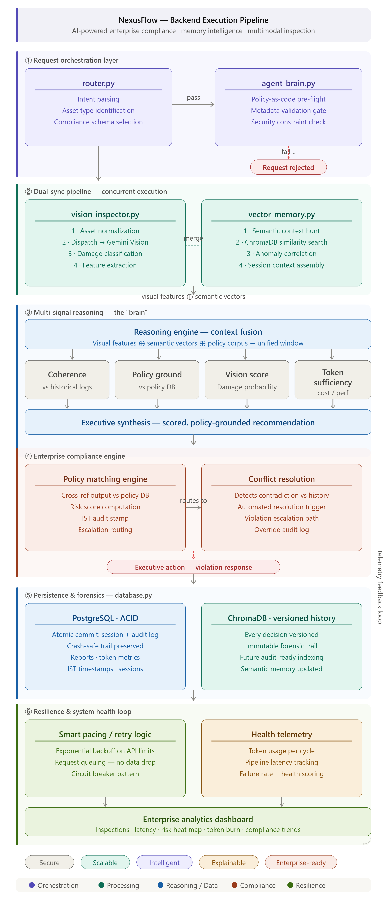

# 🚀 NexusFlow Enterprise Asset Compliance System

### AI-Powered Enterprise Asset Inspection, Compliance Automation & Multimodal Memory Intelligence

<p align="center">


</p>

---

## 📖 About NexusFlow

**NexusFlow** is an enterprise-grade AI platform that automates asset compliance inspections using multimodal artificial intelligence, semantic memory retrieval, and explainable decision-making.

The platform combines computer vision, enterprise memory, compliance validation, and AI-powered reasoning to inspect physical assets, identify damage, assess operational risks, and generate executive compliance reports. By integrating Gemini 2.5 Flash, ChromaDB, PostgreSQL, and Streamlit, NexusFlow delivers intelligent asset analysis, historical audit tracking, contextual memory retrieval, and actionable compliance recommendations through an interactive enterprise dashboard.

---

## ✨ Key Features

* 🤖 **AI-Powered Asset Inspection** – Analyze images of enterprise assets using Gemini 2.5 Flash to identify physical damage and asset conditions.

* 🧠 **Multimodal AI Reasoning** – Combine visual information with user prompts to generate intelligent, context-aware compliance assessments.

* 📚 **Semantic Memory Retrieval** – Store and retrieve historical inspection data using ChromaDB for contextual and consistent decision-making.

* 📋 **Automated Compliance Reports** – Generate structured enterprise reports including compliance requirements, operational risks, executive action items, and recommendations.

* ⚠️ **Risk Assessment Engine** – Detect potential operational and compliance risks based on asset condition and enterprise best practices.

* 🗃️ **Historical Audit Trail** – Maintain inspection history, reports, and audit records using PostgreSQL for traceability and future reference.

* 📊 **Interactive Enterprise Dashboard** – User-friendly Streamlit interface for image uploads, prompt input, report generation, and inspection history.

* 🔍 **Retrieval-Augmented Generation (RAG)** – Enhance AI responses by combining semantic memory with enterprise context for more accurate recommendations.

* 🐳 **Containerized Deployment** – Docker and Docker Compose support for simplified deployment and consistent development environments.

* 📈 **Enterprise-Ready Architecture** – Modular, scalable design that integrates AI reasoning, memory retrieval, compliance analysis, and persistent data storage.

---

## 🏗️ Technology Stack

| Category                | Technology                           | Purpose                                                                                   |
| ----------------------- | ------------------------------------ | ----------------------------------------------------------------------------------------- |
| **Backend Framework**   | Python 3.11                          | Implements business logic, AI orchestration, compliance processing, and report generation |
| **Frontend**            | Streamlit                            | Interactive web dashboard and user interface                                              |
| **AI Model**            | Gemini 2.5 Flash                     | Multimodal reasoning, image understanding, and report generation                          |
| **Vector Database**     | ChromaDB                             | Semantic memory storage and retrieval                                                     |
| **Relational Database** | PostgreSQL                           | Persistent storage for users, reports, audit logs, and inspection history                 |
| **Computer Vision**     | Gemini Vision                        | Asset image analysis and damage detection                                                 |
| **Retrieval Framework** | RAG (Retrieval-Augmented Generation) | Context-aware AI responses using enterprise memory                                        |
| **Containerization**    | Docker                               | Consistent application deployment                                                         |
| **Orchestration**       | Docker Compose                       | Multi-container service management                                                        |
| **Version Control**     | Git & GitHub                         | Source code management and collaboration                                                  |

---

## 🧩 System Architecture

**NexusFlow** follows a modular AI architecture that combines computer vision, semantic memory, and enterprise compliance reasoning into a unified inspection workflow.

Asset images and user prompts are processed through parallel **Vision** and **Memory** pipelines. The **Agent Brain** orchestrates AI reasoning, policy validation, and context retrieval before generating explainable compliance reports. Inspection records are stored in **PostgreSQL**, while semantic memory is maintained in **ChromaDB** for future retrieval.

> **Figure 1:** High-level architecture of the NexusFlow Enterprise Asset Compliance Platform.

<p align="center">
  
</p>

## ⚙️ Backend Execution Pipeline

NexusFlow processes every inspection request through a structured AI workflow. After an asset image and user prompt are submitted, the Agent Brain coordinates vision analysis, semantic memory retrieval, compliance validation, and AI reasoning to generate an executive compliance report.

The final inspection results, audit logs, and compliance reports are stored in PostgreSQL, while semantic embeddings are indexed in ChromaDB to support future contextual retrieval and continuous enterprise memory.

> **Figure 2:** Backend execution workflow of the NexusFlow Enterprise Asset Compliance Platform.

<p align="center">
  
</p>

---

## 🚀 Installation & Running

### 1️⃣ Clone the Repository

```bash
git clone https://github.com/Priyadarshini369/NexusFlow-Enterprise-Asset-Compliance.git
cd NexusFlow-Enterprise-Asset-Compliance
```

### 2️⃣ Install Dependencies

```bash
pip install -r requirements.txt
```

### 3️⃣ Configure Environment Variables

Create a `.env` file using `.env.example` and update it with your required credentials, including:

* Gemini API Key
* PostgreSQL Configuration
* ChromaDB Configuration

### 4️⃣ Start Database Services

```bash
docker-compose up -d
```

### 5️⃣ Launch the Application

```bash
streamlit run app.py
```

The application will be available at:

```text
http://localhost:8501
```

